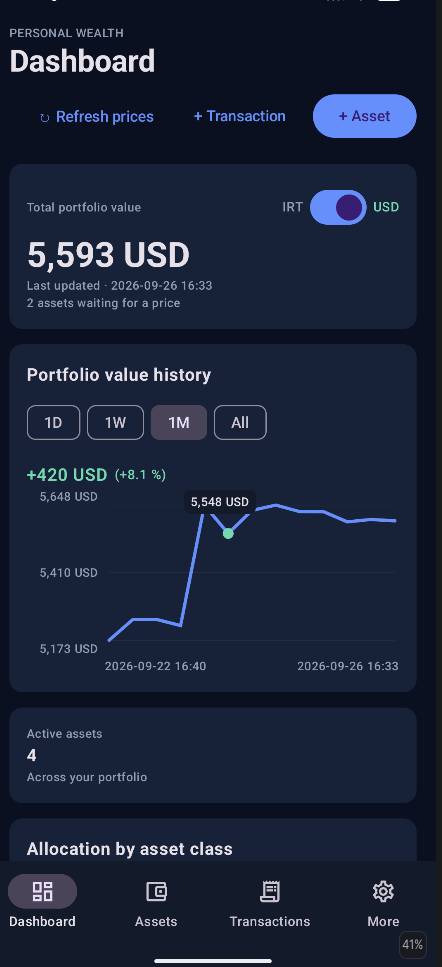

# Folio

Folio is a local-first Android app for tracking a personal investment portfolio. It is designed for portfolios that span crypto, Iranian and global equities, cash, precious metals, fixed income, and manually priced assets—without requiring an account or cloud service.

All portfolio records are stored in a Room/SQLite database on the device. Internet access is used only to look up instruments and refresh market prices; previously saved prices, valuations, and portfolio data remain available offline.

<p align="center">
  
</p>

## What it does

- Tracks assets across these classes: fixed income, US dollar, crypto, Iranian stock, global stock, gold, silver, and manual assets.
- Records buy and sell transactions, including quantity, optional unit price and fee, currency, location, and notes.
- Calculates holdings from the transaction ledger and prevents edits that would create a negative historical balance.
- Calculates weighted-average cost basis: buy fees are included; selling does not change the average cost until the holding reaches zero.
- Organizes assets with tags and storage locations such as exchanges, wallets, or physical holdings.
- Shows portfolio totals and allocation by asset class in both IRT and USD/USDT equivalents.
- Saves valuation snapshots and displays an interactive portfolio-history chart for 1 day, 1 week, 1 month, or all time.
- Supports manual prices as well as market-priced assets, with cached quotes available offline.
- Offers Persian and English interfaces, including RTL-aware Persian financial notation.

## Price providers

Market-priced assets can be searched and refreshed from public provider endpoints:

| Provider | Typical use |
| --- | --- |
| Nobitex | Crypto markets and the USDT/IRT conversion rate |
| Aban Tether | Crypto assets quoted in IRT |
| TSETMC | Iranian equities |
| Rahavard | Precious metals and supported market listings |

Folio schedules a best-effort refresh every six hours when the device has a network connection. A refresh can also be started from the dashboard. Failed calls never remove existing cached prices, and provider responses may change or become unavailable; manual pricing is always available as a fallback. No provider credentials are embedded in the app.

## Privacy and data

- No account, server, WebView, or cloud database is required.
- Portfolio data and cached prices live in local SQLite storage on the device.
- The app requests `INTERNET` solely for optional instrument search and price refresh.
- Android system backup is enabled. Folio does not currently provide a custom JSON import/export workflow.

## Build

### Requirements

- Android Studio with JDK 11 support
- Android SDK 35
- An Android 9 (API 28) or newer device/emulator

### Run from Android Studio

1. Open this repository in Android Studio.
2. Allow Gradle to sync.
3. Select an Android 9+ device or emulator.
4. Run the `app` configuration.

### Build from the command line

```bash
./gradlew :app:assembleDebug
```

The debug APK is produced under `app/build/outputs/apk/debug/`.

## Architecture

Folio is a native Kotlin application built with Jetpack Compose. Its core layers are:

| Layer | Responsibility |
| --- | --- |
| `presentation/` | Compose screens, navigation, language selection, and view-model state |
| `data/local/` | Room entities, DAO, migrations, and local persistence |
| `data/` | Repository and dashboard/history aggregation |
| `domain/` | Holdings, cost basis, pricing, currency conversion, and valuation rules |
| `data/network/` | Provider parsers, instrument search, and WorkManager price refresh |

The `assetsDashboard/` directory contains the earlier Django implementation retained as migration/reference material; the Android app does not depend on it at runtime.

## Tests

Run local unit tests with:

```bash
./gradlew :app:testDebugUnitTest
```

The test suite covers the core portfolio calculations and provider response parsers.

## Notes

Folio is a personal tracking tool, not financial advice. Market data is best-effort and should be verified before making financial decisions.
